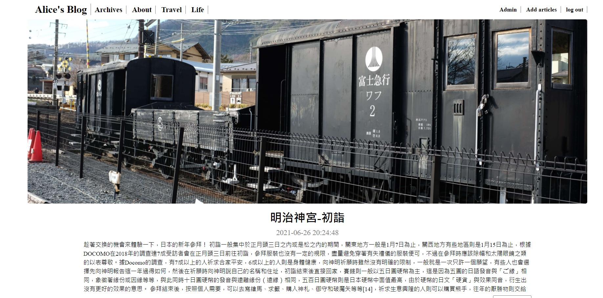

# 部落格

## 頁面介紹
1. add_articles.php：新增文章頁面
2. admin.php：管理後台
3. all_articles.php：所有文章列表
4. delete_article.php：處理刪除文章功能
5. edit_article.php：編輯文章頁面
6. handle_add_articles.php：處理新增文章功能
7. handle_edit_article.php：處理編輯文章功能
8. handle_login.php：處理登入功能
9. handle_register.php：處理註冊功能
10. index.php：部落格主頁
11. login.php：登入頁面
12. logout.php：處理登出功能
13. page.php：顯示單篇文章
14. register.php：註冊頁面

## 簡介

後端使用 PHP 和 MySQL 建立資料庫，前端使用 SCSS 切版並完成 RWD。
網站部署在 AWS EC2。

* 身為一個管理員：能夠新增、編輯、刪除文章
* 身為訪客：在首頁要能看到最新的五篇文章、可以從導覽列點入：文章列表，並看到所有文章

> 網站連結：http://aliceyoung.tw/blog/
